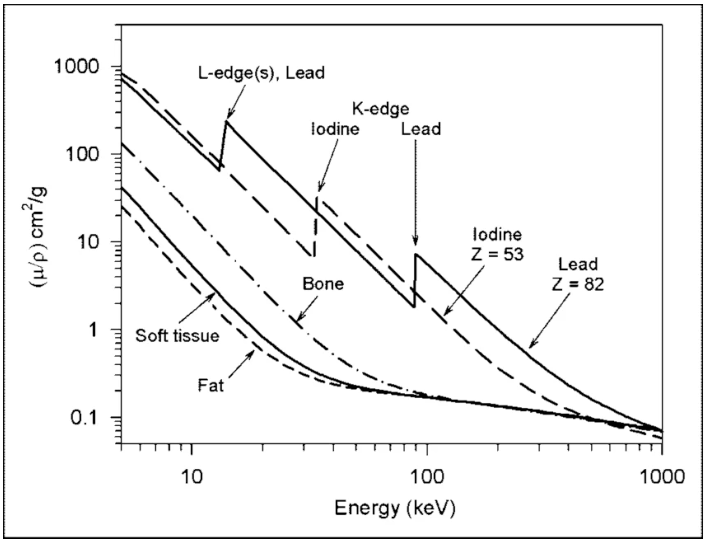

# Xray Harmonization

## 1. Background

Generalization plays a critical role in the successful deployment of artificial intelligence systems in clinical practice. However, previous studies have shown that diagnostic models trained on medical images may fail to generalize across institutions. In particular, Zech et al. <a href="#ref1">[1]</a>. demonstrated that pneumonia detection models trained on chest X-ray datasets exhibited substantial performance degradation when applied to data from different hospitals and departments. The authors attributed this lack of generalization, in part, to variability in imaging acquisition conditions, including differences in X-ray scanners used across institutions.

From a physics perspective, such behavior of diagnostic models may be explained by differences in imaging acquisition parameters. In other words, the root of this issue lies in the physical principles underlying X-ray imaging systems. In particular, the interaction of X-ray photons with matter depends strongly on photon energy and material composition. As illustrated in Figure 1, the attenuation coefficient varies as a function of X-ray energy for different materials (i.e., biological tissues). Consequently, variations in acquisition parameters—such as tube voltage (kVp) or detector characteristics—can alter the resulting image appearance and intensity distribution, potentially affecting the performance and generalization of AI models.

  
   
  <em>Figure 1. Attenuation coefficient as a function of X-ray energy for different materials.</em>

As a result, the texture patterns visible in an image can vary systematically with acquisition energy <a href="#ref2">[2]</a>. This means that the same anatomical structures may produce distinct texture distributions under different scanner settings. For convolutional neural networks (CNNs) trained on images acquired at a specific energy range, exposure to images obtained with different beam energies effectively introduces unseen texture patterns <a href="#ref3">[3]</a>. Prior work has shown that standard CNN architectures trained on natural images often classify objects based on texture rather than shape <a href="#ref4">[4]</a>. Consequently, changes in acquisition conditions that alter image texture patterns may introduce distribution shifts that degrade model performance <a href="#ref5">[5]</a>.

Previous studies have shown that such scanner- and protocol-induced variability can significantly impact the robustness and fairness of diagnostic AI models  <a href="#ref5">[6]</a>. Addressing this source of heterogeneity is therefore essential for developing reliable and generalizable models across diverse imaging environments.

## 2. Aims

This project aims to investigate how image normalization and harmonization techniques affect the reliability and fairness of AI-based diagnostic models trained on heterogeneous X-ray datasets.  
The main objectives are as follows:

1. **Compare data normalization methods**  
   Evaluate and contrast multiple normalization and harmonization techniques (e.g., histogram matching, z-score normalization, quantile mapping, and physics-based corrections) applied to X-ray datasets acquired from scanners with varying technical characteristics.

2. **Assess their impact on diagnostic models**  
   Quantify how different normalization approaches influence the performance, calibration, and generalization of AI-based diagnostic models across diverse imaging sources and acquisition conditions.

3. **Develop practical guidelines**  
   Formulate recommendations for selecting optimal normalization strategies that improve diagnostic consistency, fairness, and robustness across imaging environments.

## 3. MIMIC Collection

Source: https://mimic.mit.edu/docs/gettingstarted/
Clinical data: https://mimic.mit.edu/docs/iv/modules/

## 4. Metadata

Current project based on MIMIC-IV v3.1

## 5. SQLite

Create SQLite version of data storage so information can be processed via SQL language to increase repeatability and reproducibility of the work.

## 6. Code Description

To download the dataset use `python/download_data.ipynb`. It is important to note that you have to get an access to the data prior start downloading.

### 6.1 Dataset Creation

### 6.2 Aquisition Information Deriving

### 6.3 Training model for Scanner Type Classification

### 6.4 Deep Feature Extraction and Analysis

### 6.5 Harmonization

#### 6.5.1 Min/Max Harmonization

#### 6.5.2 Distribution Function Harmonization

#### 6.5.3 Harmonization in Fourier Space

## 6. Contacts

If you have any questions, please contact us:

- **Saeed Aalahmari** – [aalahmari.saeed@gmail.com](mailto:aalahmari.saeed@gmail.com)  
- **Dmitrii Cherezov** – [dmitry.cherezov@gmail.com](mailto:dmitry.cherezov@gmail.com)  
- **Michael Gardner** – [mgardner@kfu.edu.sa](mailto:mgardner@kfu.edu.sa)

## References

1. Zech, J.R., Badgeley, M.A., Liu, M., Costa, A.B., Titano, J.J. and Oermann, E.K., 2018. Confounding variables can degrade generalization performance of radiological deep learning models. arXiv preprint arXiv:1807.00431.

2. Gao, Y., Shi, Y., Cao, W., Zhang, S. and Liang, Z., 2019. Energy enhanced tissue texture in spectral computed tomography for lesion classification. Visual Computing for Industry, Biomedicine, and Art, 2(1), p.16.

3. Chen, Y., Zhong, J., Wang, L., Shi, X., Lu, W., Li, J., Feng, J., Xia, Y., Chang, R., Fan, J. and Chen, L., 2022. Robustness of CT radiomics features: consistency within and between single-energy CT and dual-energy CT. European Radiology, 32(8), pp.5480-5490.

4. Moreno-Torres, J.G., Raeder, T., Alaiz-Rodríguez, R., Chawla, N.V. and Herrera, F., 2012. A unifying view on dataset shift in classification. Pattern recognition, 45(1), pp.521-530.

5. Cherezov, D., Fu, P. and Madabhushi, A., 2025. Quantitative assessment of impact of technical and population-based factors on fairness of AI models for chest X-ray scans. Computers in Biology and Medicine, 198, p.111147.

6. 

7. 

8. 

9. 

## Interesting papers

#### 1. 
Taguchi K, Iwanczyk JS (2013) Vision 20/20: single photon counting x-ray detectors in medical imaging. Med Phys 40(10):100901. https://doi.org/10.1118/1.4820371
Based on the paper, five energy channel images can be obtained with some PCD-XR systems.

Taguchi and Iwanczyk (2013) discuss multi-energy radiography, referred to as PCD-XR (Photon Counting Detector X-Ray imaging), as a parallel development to photon-counting CT. While the paper primarily focuses on CT, the authors explicitly state that most detector technologies, imaging methods, and clinical benefits discussed apply to X-ray imaging as well. PCD-XR systems use energy-discriminating detectors to count photons in multiple energy windows, preserving spectral information that is lost with conventional energy-integrating detectors. This enables improved contrast-to-noise ratio, dose reduction, quantitative imaging, and K-edge imaging capabilities.

At the time of publication, the paper notes that PCD-XR systems had already entered clinical use. The MicroDose Mammography system (Philips) is highlighted as a commercial example, utilizing an edge-on silicon strip PCD with a multi-slit scanning technique to achieve low-dose, high-quality images with minimal scatter. Additionally, bone mineral density systems such as Lunar iDXA (GE Healthcare) and Stratos DR (DMS-APELEM) equipped with PCDs from DxRay, Inc. had been on the market for several years. The authors conclude that PCD-XR represents not merely an evolution but a revolution in X-ray imaging, with potential for molecular imaging and personalized medicine applications.

#### 2.
Qasempour, Y., Mohammadi, A., Rezaei, M., Pouryazadanpanah, P., Ziaddini, F., Borbori, A., Shiri, I., Hajianfar, G., Janati, A., Ghasemirad, S. and Abdollahi, H., 2020. Radiographic texture reproducibility: The impact of different materials, their arrangement, and focal spot size. Journal of Medical Signals & Sensors, 10(4), pp.275-285.
Even when the kVp is the same, there are other parameters that impact reproducibility.

This study by Qasempour et al. (2020) investigated the reproducibility of radiographic texture features against changes in three specific parameters: focal spot size (0.6 mm vs. 1.2 mm), different phantom materials (wood, sponge, Plexiglas, rubber), and different arrangements of those materials. A detachable phantom was constructed with 1 cm thick sections of each material, and images were acquired using a digital radiography machine with consistent exposure parameters (40 kV, 4 mAs). Twenty-two texture features from histogram, GLCM, GLRLM, autoregressive, and wavelet families were extracted and analyzed using coefficient of variation (COV), intraclass correlation coefficient (ICC), and Bland-Altman methods to assess reproducibility.

Results showed that texture feature reproducibility varied considerably across conditions. Against changes in focal spot size, 59% of features were highly reproducible (COV ≤ 5%), while only 4.5% of features maintained this level of reproducibility against changes in phantom materials. Against changes in material arrangement, 50% of features were highly reproducible. ICC analysis showed most features had excellent test-retest reliability (>0.90) for repeated imaging of individual materials. Bland-Altman analysis identified only one feature (SumVarnc) as non-reproducible against focal spot changes. The authors conclude that radiomic textures are vulnerable to changes in materials, their arrangement, and focal spot size, emphasizing that careful analysis of these parameters is essential before clinical application of radiomics.

